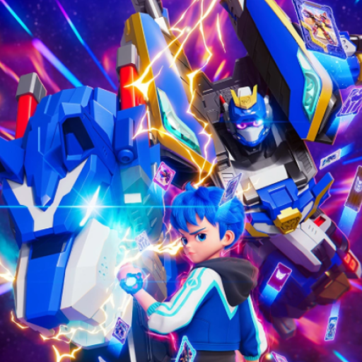

# Metal Cardbot Character

<p align= "center">
  
  <br>
  <b>Metal Cardbot Character Logo Apps</b>
</p>

***I am using the API from***
```https://github.com/Servant-Of-God-1/Metal_Cardbot_restful_API_code```
***to display the information in this application.***
***This application will display information about Metal Cardbot characters once the RESTful API available at the link below has been successfully deployed.***
```https://github.com/Servant-Of-God-1/Metal_Cardbot_restful_API_code```
***Don't worry; instructions for self-deployment are available in the `README.md` file within the RESTful API repository. After you have successfully deployed the restful API, please edit the base URL in the ApiConfig.kt file, the file location is at***
```app\src\main\java\com\example\testingmyapi\api```
***in the code written as shown below***
``` private const val BASE_URL = "your base url"```
# Features of the Metal Cardbot character app
## 1. Splash Screen (with Video Animation)
***This page features the animated intro video for *Metal Cardbot* Season 3 (given that Season 3 is nearing its end, I plan to replace the intro animation if a new season is released—and if I have the time to do so). Once the video finishes playing, it will automatically proceed to the next page.***
## 2. Login and registration page
*** Don't worry about the security of the data you have provided to this application; the login and registration pages serve solely as gateways to access the subsequent screens, with the data stored locally (via internal storage). Press `Register` and fill in the required information to proceed to the next page.***
